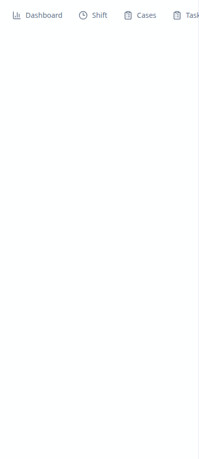
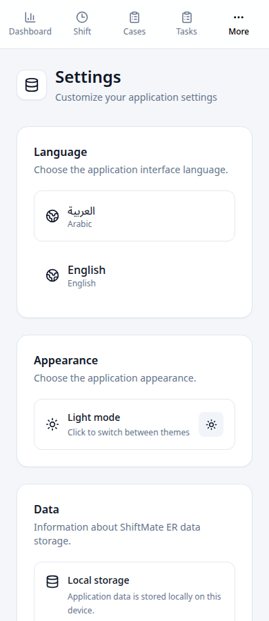
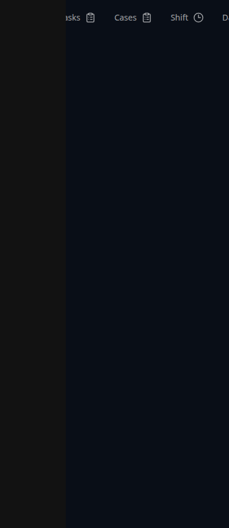
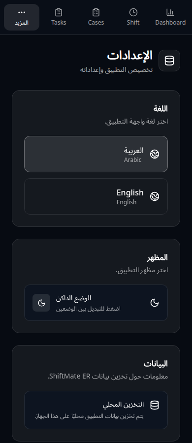

# Issue #13: responsive shell verification

Baseline: `87f9b3df8de27ac54e9131e83037001ee3c884c3` (main).
Tested on 2026-10-06 with Chromium 153 / Playwright against production Vite builds.
Only synthetic demo data was used in isolated browser contexts.

The shell previously placed full-width mobile navigation beside a shrinking main
panel. It now stacks navigation above the scrolling content below 768px, with
five equal-width icon/label navigation cells. The desktop sidebar remains 224px.
`min-h-0` lets the content scroll within the remaining viewport height, and the
sidebar divider follows the text direction.

## Before/after measurements

All rows were repeated in English/LTR and Arabic/RTL, light and dark.
Viewport height: 900px. Measurements are CSS pixels, with the More menu closed.

| Viewport | Main width before | Main width after | Page scroll width before (EN / AR) | Page scroll width after |
| --- | ---: | ---: | ---: | ---: |
| 390 | 0 | 390 | 505 / 503 | 390 |
| 768 | 544 | 544 | 768 / 768 | 768 |
| 1280 | 1056 | 1056 | 1280 / 1280 | 1280 |

Neighboring phone widths 320 and 430 also passed in both languages/themes.
After the fix the 390px navigation is 71px tall and main content is 829px tall.
No page-level horizontal overflow or navigation overflow was measured after the
fix. Full measurements: [layout-measurements.json](layout-measurements.json).

| English / light before | English / light after |
| --- | --- |
|  |  |

| Arabic / dark before | Arabic / dark after |
| --- | --- |
|  |  |

## Workflow coverage

At each of 390, 768 and 1280px, in both languages and both themes:

1. Sign in using the local demo button.
2. Navigate to Shift and start a shift.
3. Create a synthetic case, task, handover, note and reminder through the forms.
4. Complete the task.
5. Visit every primary and More-menu destination.
6. Change language and theme in Settings; check document direction/theme.
7. Open and dismiss More using its backdrop; verify secondary links close.
8. End the shift and visit History.
9. Reload and verify saved synthetic data persists.

Route transitions are awaited using the destination heading, before interacting
with a form. An initial test used any visible heading and raced navigation once;
that harness synchronization was corrected before the final full matrix run.

README's responsive-interface statement is supported by this viewport coverage.
This is browser workflow/layout verification, not clinical validation or native
Tauri runtime testing. Native Rust checks run through the existing CI workflow.

Final workflow matrix: **12/12 passed**, no browser page errors.
Detailed results: [workflow-results.json](workflow-results.json).
Local checks passed: `npm ci` (using a writable temporary npm cache),
`npm run build`, `npm audit` (0 vulnerabilities), Rust formatting, and the
Tauri-relative frontend build (`TAURI_ENV_PLATFORM=linux npm run build`).
